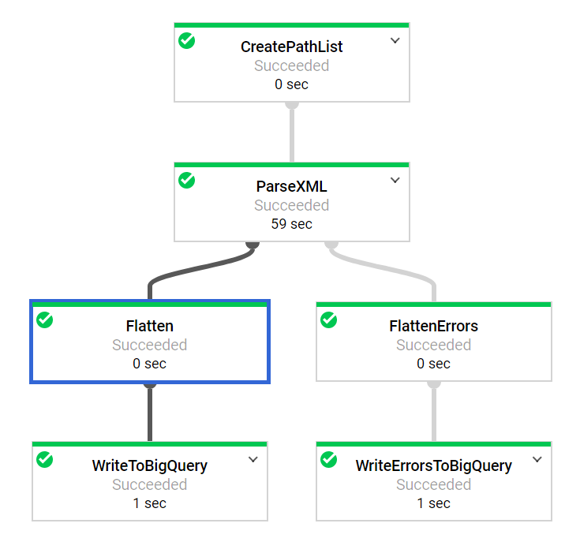

# Demo ETL process using Google Dataflow (Apache Beam)
This Python process does the following:
- accepts several parameters from the command line
- reads in XML files from a GCS bucket using a file pattern
- parses the XML file using the ElementTree 
- extracts desired data and writes it to a BigQuery table
- any errors are written to a separate table via a "side output"

If you have thousands of XML files to parse, then Dataflow will scale up 
the number of "worker" nodes and complete the job more quickly than if you 
just used one basic node.  No extra coding is required for this autoscaling - it's
automatic (one of Dataflow's appealing features).

Visualisation from GCP Dataflow console:

